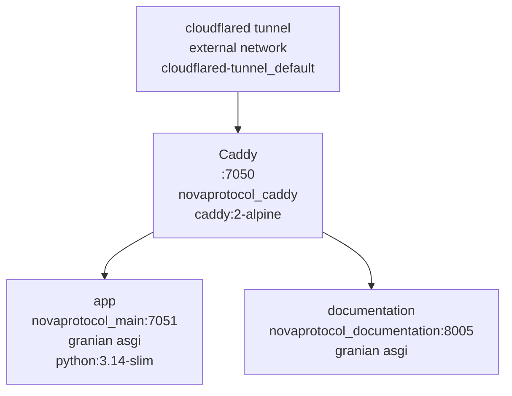

# Architecture

## Stack at a Glance

| Layer | Choice |
|-------|--------|
| Runtime | Python 3.14-slim, `granian` ASGI (prod), `uvicorn` (dev) |
| Framework | FastAPI with `create_app()` factory (`apps/__init__.py`), `APIRouter` in `apps/routes.py` |
| SVG Engine | `utilities/terminal_svg/` — standalone lib (ansi → timeline → render → core) + `svgwrite` |
| Badge Modules | `apps/name_svg.py`, `apps/console_svg.py`, `apps/skills_svg.py` — data + `render_*_svg()` |
| Content | `data/github_profile.html` (scraped snapshot, not used by `/test`) + live `<object>` gallery in `apps/test_page.py` |
| Styling | No frontend framework — SVGs are self-contained; `/test` is a minimal HTML shell |
| Proxy | `caddy:2-alpine` on `:7050`, loopback-only publish via tunnel, **no** `forward_auth` (intentionally public) |
| Docs | MkDocs Material on `:8005` (`novaprotocol_documentation`), served by FastAPI + granian, **public** at `/documentation/*` |
| Auth | None — public asset server; image embedders have no cookie jar |

---

## Monolith Topology

This is a **single-service monolith** (`apps/` factory) — one purpose (serve three SVGs), one deployable. No `shared/` package and no multi-service split.

```
project/
├── apps/
│   ├── __init__.py        # create_app() factory, access-log middleware, mounts /static
│   ├── config.py          # frozen dataclass BaseConfig/DebugConfig/ProductionConfig + get_config()
│   ├── routes.py          # APIRouter — GET /, /health, /name.svg, /console.svg, /skills.svg, /test
│   ├── name_svg.py        # NOVA ASCII art + render_name_svg()
│   ├── console_svg.py     # Full boot/console session + render_console_svg()
│   ├── skills_svg.py      # Summary/tech-stack/cert/projects panes + render_skills_svg()
│   └── test_page.py       # /test live gallery — embeds the three SVGs via <object>
├── utilities/
│   └── terminal_svg/      # Standalone reusable lib — no imports from apps/
│       ├── __init__.py    # Re-exports TerminalSVG, Style, parse_ansi, palette
│       ├── ansi.py        # SGR parsing + palette + Style/Segment
│       ├── timeline.py    # build_timeline() — per-char begin times
│       ├── render.py      # render_svg() — svgwrite + SMIL <animate>
│       ├── core.py        # TerminalSVG facade — entries → timeline → SVG
│       └── __main__.py    # Demo — write + open a temp SVG
├── data/
│   └── github_profile.html # Ignored snapshot (gitignored) — not served
├── static/.gitkeep        # Mounted at /static (empty, reserved)
├── templates/             # (none — SVGs are code-generated, /test is inline HTML)
├── caddy/Caddyfile + Dockerfile
├── documentation/         # MkDocs site (this site)
├── wsgi.py                # granian target wsgi:app — app = create_app()
├── run.py                 # uvicorn dev entrypoint — --mode debug|production
├── Dockerfile             # python:3.14-slim, fonts-dejavu-core, appuser uid 10001, granian on 7051
└── compose.yaml           # app + caddy + documentation
```

### App factory

```python
# apps/__init__.py
from apps.config import get_config


def create_app() -> FastAPI:
    config = get_config()
    app = FastAPI(title="NovaProtocol Assets", debug=config.DEBUG)
    app.mount("/static", StaticFiles(directory=str(static_dir)), name="static")
    from apps.routes import router

    app.include_router(router)
    return app
```

`wsgi.py` calls it once (`app = create_app()`); tests call `create_app()` per test via `TestClient`. No module-level `app = FastAPI()` inside `apps/`. The factory also installs a tiny access-log middleware that mirrors `shared/logger` style but without SQLite.

### Config

```python
# apps/config.py
@dataclass(frozen=True)
class BaseConfig:
    DEBUG: bool = False


@dataclass(frozen=True)
class DebugConfig(BaseConfig):
    DEBUG: bool = True


@dataclass(frozen=True)
class ProductionConfig(BaseConfig):
    DEBUG: bool = False


def get_config() -> BaseConfig:
    return (
        ProductionConfig() if os.environ.get("DEPLOYMENT_TYPE") == "production" else DebugConfig()
    )
```

No secrets — only `DEPLOYMENT_TYPE`. Read strictly from `os.environ`; no `load_dotenv`.

### Routing

One `APIRouter` in `apps/routes.py` — five routes plus `/test`:

```python
@router.get("/")           # -> {"service": "NovaProtocol Assets", "status": "ok"}
@router.get("/health")     # -> {"status": "ok"}  — compose + Caddy probe
@router.get("/name.svg")   # -> image/svg+xml, no-store
@router.get("/console.svg")
@router.get("/skills.svg")
@router.get("/test")       # -> text/html gallery (apps/test_page.py)
```

SVG routes return `Response(content=render_*_svg(), media_type="image/svg+xml", headers=_NO_CACHE)` where `_NO_CACHE = {"Cache-Control": "no-store, max-age=0"}`. The gallery at `/test` returns `HTMLResponse(test_page.render_test_page())` — it builds a self-contained HTML doc embedding the three live SVGs via `<object data="/name.svg">` so SMIL animations run.

---

## Terminal SVG Pipeline

```
COMMANDS (apps/*_svg.py)  →  TerminalSVG (utilities/terminal_svg/core.py)
                                │
                                ├─ build_timeline()  (timeline.py)
                                │     parse_ansi() per line (ansi.py) → per-Char begin times
                                │
                                └─ render_svg()      (render.py)
                                      svgwrite + <animate> (SMIL) → SVG string
```

- **Entries** are dicts: `{"input": "...", "output": ["..."], "custom_prefix": "...", "custom_start_delay": s, "custom_end_delay": s, "delay": s}`. Badge modules define `COMMANDS: list[dict]` as session scripts.
- **ANSI** is inline (`\x1b[32m`, `\x1b[90m`, `\x1b[0m`) plus a custom `\x1b[<ms>p` pause escape. See [ANSI Parsing](terminal-svg/ansi.md).
- **Timeline** expands each entry into `Row`s of `Char`s with absolute `begin` seconds. See [Timeline Engine](terminal-svg/timeline.md).
- **Render** emits a fixed `880×(60 + max_line*20 + 6)` SVG with a clipped viewport, chrome (title bar), and per-`tspan` `<animate>` for typewriter appearance and scrolling. See [Rendering](terminal-svg/render.md).
- **Core** (`TerminalSVG`) is the public facade: set `max_line`, `command_prefix`, per-char/line delays, `add_line(entry)`, `render()`. See [Core API](terminal-svg/core.md).

Full deep-dives: [Terminal SVG Overview](terminal-svg/index.md), [SVG Badges](svg-badges/index.md).

---

## Caddy & Networking



- Caddy listens on `:7050` (`Caddyfile` site address `:7050`), matching `compose.yaml` `127.0.0.1:7050:7050` and the app's `EXPOSE 7051`.
- `handle /health { reverse_proxy novaprotocol_main:7051 }` bypasses everything (tunnel and compose probes). No `forward_auth`.
- `handle_path /documentation/* { reverse_proxy novaprotocol_documentation:8005 }` — **public**, prefix-stripped (`handle_path`). Serves the prebuilt MkDocs `site/` via FastAPI on `:8005`.
- `handle { reverse_proxy novaprotocol_main:7051 }` — everything else public (the three SVGs and `/test`).
- Proxy targets use `container_name` (`novaprotocol_main`, `novaprotocol_documentation`), never the generic service name `app`, to avoid the shared-network DNS collision where every `app` alias on `cloudflared-tunnel_default` would resolve together (see `reference/docker/compose.md` → Shared-network DNS gotcha).
- Compose: app and docs on `default`; caddy on `default` + `cloudflared-tunnel` (external). Caddy publishes `127.0.0.1:7050:7050` loopback-only.
- Healthchecks: `python -c "import urllib.request; urllib.request.urlopen('http://127.0.0.1:<port>/health')"` with 30s interval, 5s timeout, 3 retries.

!!! note "No gatekeeper network"
    This is the only portfolio project whose `compose.yaml` does **not** join `gatekeeper_default` and whose `Caddyfile` has **no** `forward_auth gatekeeper:7000`. That is intentional and documented here and in [Docker & Deployment](docker.md). Adding a gate would break GitHub profile embeds.

---

## Testing

- `tests/test_routes.py` — health and SVG routes via `TestClient(create_app())` (health JSON, content-type, cache-control, presence checks for "Khyles", "nova@ProjectNova", "Python").
- `tests/test_terminal_svg.py` — `parse_ansi` (color, bold/underline, reset, delay escape), `TerminalSVG` rendering (tspan/animate/scroll, prefix, timing).
- `tests/test_console_svg.py`, `tests/test_name_svg.py` — badge smoke checks.

Run: `pytest -q` or `pre-commit run --all`.

---

## Deployment Notes

- **Remote only.** The deployed `compose.yaml` lives on the Dockhand host; use `scripts/docker.sh` to inspect production, never `docker ps` locally. Owner deploys; agents fix code and commit.
- `ENV PYTHONDONTWRITEBYTECODE=1 PYTHONUNBUFFERED=1` set early in Dockerfiles.
- Images run as non-root `appuser` (uid `10001`), `EXPOSE` matches Caddy targets, `CMD` is exec-form granian.
- Pre-commit gates all commits locally; no `.github/workflows` (billable Actions).
- `docs/` is gitignored superpowers scratch (`docs/superpowers/plans/`); real docs are `documentation/` (tracked, Material theme).
