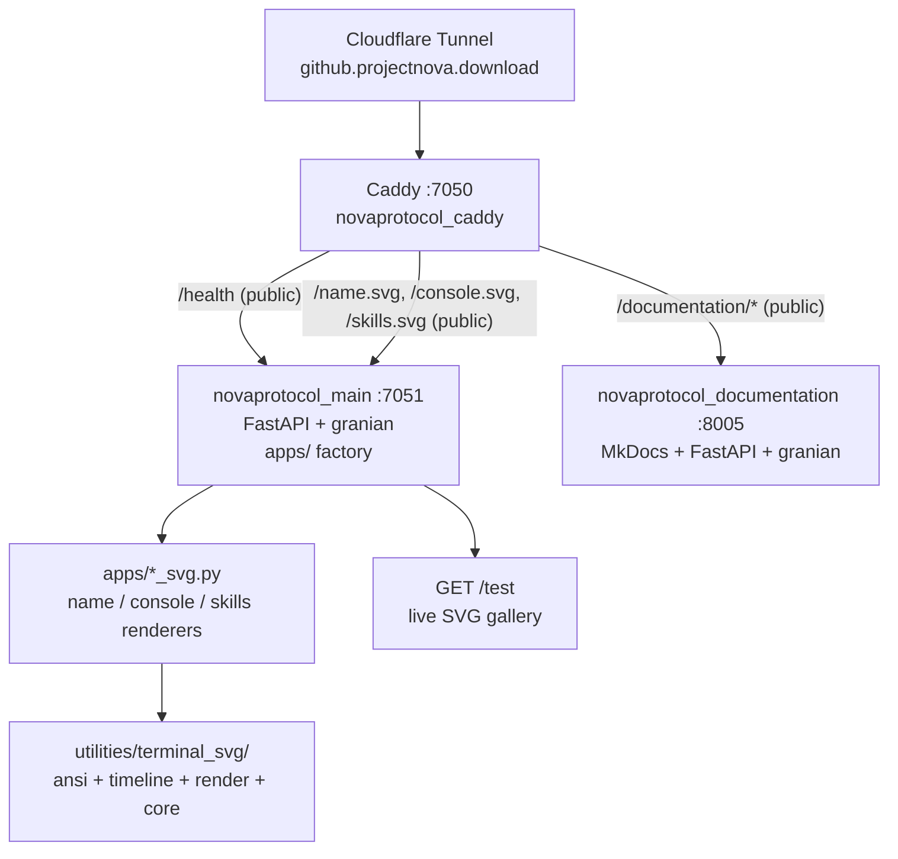

# NovaProtocol

Public **FastAPI asset server** that renders the three animated terminal SVGs embedded in the [NovaProtocol GitHub profile](https://github.com/NovaProtocol) — `name.svg`, `console.svg`, and `skills.svg`. Served as a monolith behind Caddy on `:7050` (app on `:7051`) and intentionally **ungated** (no GateKeeper), because image embedders have no cookie jar.

**Stack:** Python 3.14 · FastAPI + granian (ASGI) · `utilities/terminal_svg` (custom ANSI → SMIL SVG library) · `svgwrite` · Caddy 2 (Alpine) · MkDocs Material.

## Services Overview

| Service | Container | Internal Port | Caddy Route | Network |
|---------|-----------|---------------|-------------|---------|
| **Caddy** | `novaprotocol_caddy` | `:7050` | — | `default`, `cloudflared-tunnel` |
| **App (monolith)** | `novaprotocol_main` | `:7051` | `/*` via `novaprotocol_main:7051` | `default` |
| **Documentation** | `novaprotocol_documentation` | `:8005` | `/documentation/*` via `novaprotocol_documentation:8005` | `default` |

- `GET /health` bypasses everything — tunnel and compose healthchecks.
- `GET /documentation/*` is **public** (no `forward_auth`) — docs are safe to embed and cache like the SVGs.
- All other routes (`/`, `/name.svg`, `/console.svg`, `/skills.svg`, `/test`) are public by design — no auth gate.
- No gRPC — single-service monolith with no container-to-container RPC (see [Why No gRPC](why-no-grpc.md)).

## Quick Links

- [Getting Started](getting-started.md) — run locally and in Docker.
- [Architecture](architecture.md) — layout, factory, routing, and why there is no gRPC.
- [Terminal SVG](terminal-svg/index.md) — the `utilities/terminal_svg` engine.
- [SVG Badges](svg-badges/index.md) — how the three badges are built.
- [API Reference](api-reference.md) — HTTP routes, caching headers, and content types.
- [Docker & Deployment](docker.md) — compose, Caddy, and prod notes.
- [Why No gRPC](why-no-grpc.md) — documented decision to stay HTTP-only.

## Relationship to House Reference

This project follows `~/Projects/agent_stuff/reference/` for monolith layout (`apps/` factory, `utilities/` standalone, `data/` static HTML), Docker conventions (`python:3.14-slim`, `granian`, `appuser` uid `10001`, loopback-only publish), Caddy public routing (no `forward_auth`), and per-project MkDocs at `documentation/` (Material theme, `8005`, `handle_path /documentation/*`).

??? note "Intentionally public — no GateKeeper"
    Unlike Buddy's, Portfolio, SolveSpace, and WBS, NovaProtocol is **not** gated. The SVGs are `` embeds in a GitHub profile README. GitHub's image proxy and browsers fetch without cookies — `forward_auth gatekeeper:7000` would `302` to login and the image would break. The Caddyfile therefore has no `forward_auth` block at all, and `compose.yaml` does not join `gatekeeper_default`. Documentation follows the same rule — `/documentation/*` is public — because the project's assets are public.
